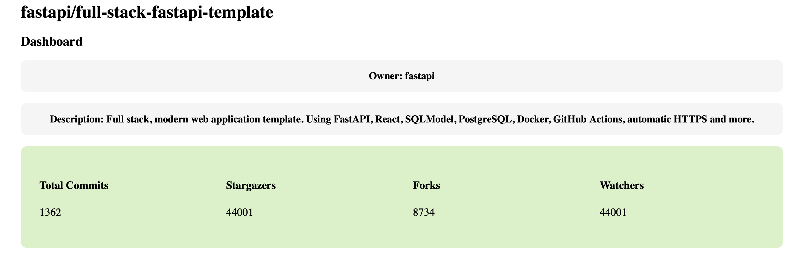
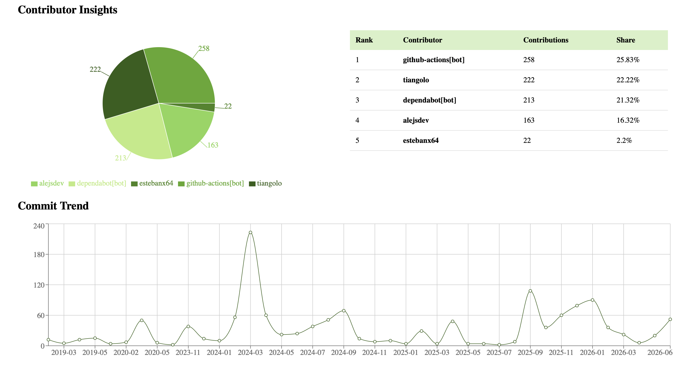
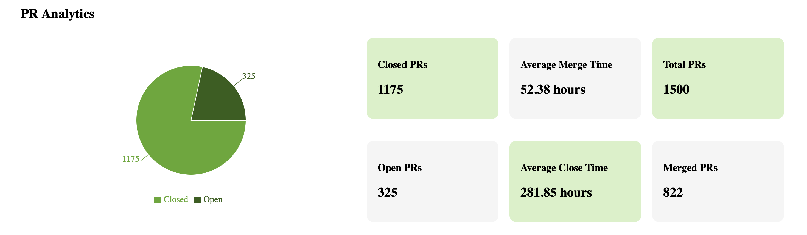
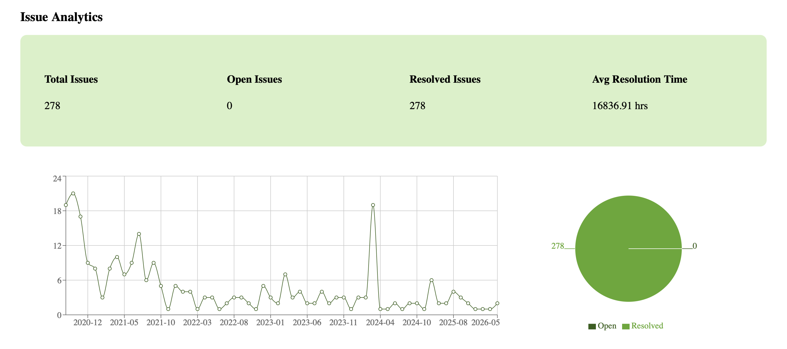
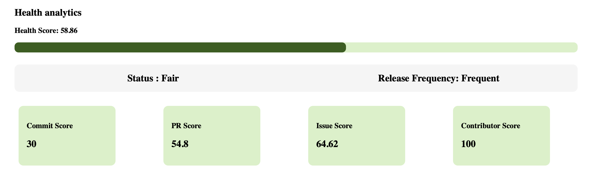

# GitHub Analytics Dashboard

A full-stack GitHub Analytics Dashboard that collects repository data using the GitHub REST API, stores it in a local database, and presents interactive analytics through a modern React dashboard.

---

## Features

- Repository Overview
- Commit Analytics
- Pull Request Analytics
- Issue Analytics
- Contributor Analytics
- Release Analytics
- Interactive Charts
- Real-time GitHub Data Fetching
- Responsive Dashboard UI

---

# Screenshots

## Search page


---


## Home Page




---

## Commit Analytics




---

## Pull Request Analytics




---

## Issue Analytics




---

## Health Analytics




---


# Tech Stack

### Frontend

- React
- React Router
- Recharts
- CSS

### Backend

- FastAPI
- SQLAlchemy
- SQLite

### APIs

- GitHub REST API

---

# Architecture

```
                GitHub REST API
                       │
                       ▼
              FastAPI Backend
                       │
      ┌────────────────┼────────────────┐
      ▼                ▼                ▼
 Data Collection   Analytics API    Database
                                   (SQLite)
                       │
                       ▼
                React Frontend
                       │
                       ▼
              Interactive Dashboard
```

---

# Project Structure

```
github-analytics-dashboard/
│
├── backend/
│   ├── routers/
│   ├── models/
│   ├── database.py
│   ├── analytics.py
│   └── main.py
│
├── frontend/
│   ├── src/
│   │   ├── pages/
│   │   ├── components/
│   │   ├── charts/
│   │   └── App.jsx
│
├── images/
│
└── README.md
```

---

# Data Flow

1. User enters a GitHub repository.
2. Backend fetches data from the GitHub REST API.
3. Repository data is stored in SQLite.
4. Analytics endpoints process stored data.
5. React frontend requests analytics from FastAPI.
6. Dashboard displays charts and statistics.

---

# Analytics Implemented

## Repository Activity

- Total Commits
- Active Contributors
- Commits in Last 30 Days
- Average Commits per Contributor

---

## Commit Analytics

- Monthly Commit Trend
- Top Contributors
- Commit Activity Distribution

---

## Pull Request Analytics

- Total Pull Requests
- Open vs Closed vs Merged
- Average Merge Time
- Average Close Time
- Monthly PR Trend

---

## Issue Analytics

- Total Issues
- Open vs Closed
- Average Resolution Time
- Issue Creation Trend

---

## Contributor Analytics

- Total Contributors
- Top Contributors
- Commit Distribution

---

## Release Analytics

- Total Releases
- Latest Release
- Release Timeline

---

# Installation

## Clone Repository

```bash
git clone https://github.com/nivakalia/github-analytics-dashboard.git

cd github-analytics-dashboard
```

---

## Backend Setup

```bash
cd backend

python -m venv venv
```

Activate virtual environment

### Windows

```bash
venv\Scripts\activate
```

### macOS/Linux

```bash
source venv/bin/activate
```

Install dependencies

```bash
pip install -r requirements.txt
```

Run FastAPI

```bash
uvicorn main:app --reload
```

Backend runs at

```
http://localhost:8000
```

Swagger documentation

```
http://localhost:8000/docs
```

---

## Frontend Setup

```bash
cd frontend

npm install

npm run dev
```

Frontend runs at

```
http://localhost:5173
```

---

# API Endpoints

## Data Collection

```
POST /fetch/repository/{owner}/{repo}

POST /fetch/commits/{owner}/{repo}

POST /fetch/pullrequests/{owner}/{repo}

POST /fetch/issues/{owner}/{repo}

POST /fetch/contributors/{owner}/{repo}

POST /fetch/releases/{owner}/{repo}
```

---

## Analytics

```
GET /analytics/repository-activity/{owner}/{repo}

GET /analytics/commit-analysis/{owner}/{repo}

GET /analytics/pr-analysis/{owner}/{repo}

GET /analytics/issue-analysis/{owner}/{repo}

GET /analytics/contributor-analysis/{owner}/{repo}

GET /analytics/release-analysis/{owner}/{repo}
```

---

# Future Enhancements

- GitHub OAuth Authentication
- Repository Search
- Organization Analytics
- Branch Analytics
- Code Frequency Analytics
- Fork & Star Growth Trends
- Export Reports (PDF/CSV)
- Dark Mode
- Docker Deployment
- PostgreSQL Support
- Live Refresh
- CI/CD Pipeline

---

# Author

**Niva Kalia**

GitHub: https://github.com/nivakalia

---

